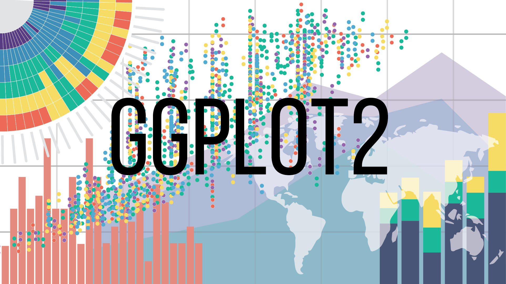

  

 

### How to improve visualization in R using ggplot2

Oct 29, 2019
 

In this blog post, I will provide some common but simple methods you can use when trying to create an informative and meaningful graphic in R using ggplot2.  
[Read On](Blog1.html)